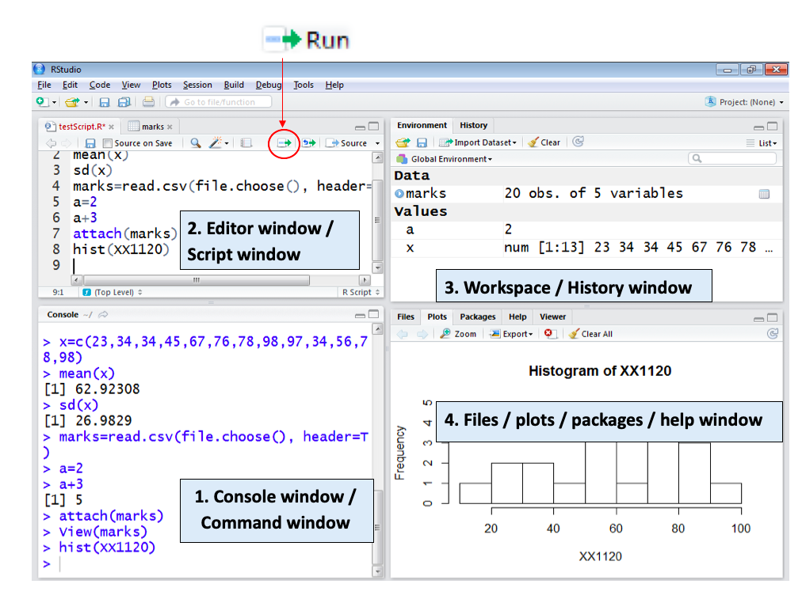
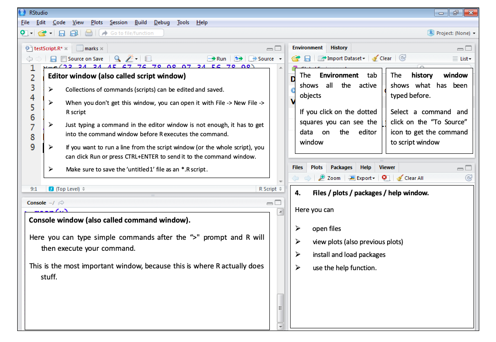

# Introduction to R, Rstudio and Posit Cloud {#intro}

\pagenumbering{arabic}

## Installing R and Rstudio

<<<<<<< HEAD
- **Step 1:** First download R freely from the Comprehensive R Archive Network (CRAN) [https://posit.co/download/rstudio-desktop/](https://posit.co/download/rstudio-desktop/).
(At the moment of writing, R 4.2.3  is the latest version. Choose the most recent one.)
=======
- **Step 1:** First download R freely from the Comprehensive R Archive Network (CRAN) [https://cran.r-project.org/](https://cran.r-project.org/).
<<<<<<< HEAD
(At the moment of writing, R 4.4.1  is the latest version. Choose the most recent one.)

- **Step 2:** Then install R Studio’s IDE (stands for integrated development environment), a powerful user interface for R from [https://posit.co/download/rstudio-desktop/](https://posit.co/download/rstudio-desktop/. Get the Open Source Edition of RStudio Desktop. RStudio allows you to run R in a more user-friendly environment.
=======
(At the moment of writing, R 4.2.2  is the latest version. Choose the most recent one.)
>>>>>>> db2d36962e520f9ed1862fd4eb2c519e8da84f67

- **Step 2:** Then install R Studio’s IDE (stands for integrated development environment), a powerful user interface for R from [https://posit.co/download/rstudio-desktop/](https://posit.co/download/rstudio-desktop/). Get the Open Source Edition of RStudio Desktop. RStudio allows you to run R in a more user-friendly environment.
>>>>>>> 6da6143e6ad07463649fb2aae6d4caebd3bea4f0

   - You need to install **both** R and Rstudio to use RStudio.

   - If you have a pre-existing installation of R and/or RStudio, I highly recommend that you reinstall both and get as current as possible. 

- **Step 3:** Then open **Rstudio**.


### Posit Cloud

- In 2022, RStudio changed its corporate name to Posit with the aim of expanding its focus beyond R to include users of Python and Visual Studio Code.

- If you don't want to download or install R and R Studio, you can use RStudio on [Posit Cloud] (https://posit.cloud/) for free.

## RStudio layout

The RStudio interface consists of four windows (see Figure 1 and 2).

1.	Bottom left: console window (also called command window). **This is where you type and run all your R commands**

2.	Top left: editor window (also called script window). 

3.	Top right: workspace / history window.

4.	Bottom right: Files / plots / packages / help window.


```{r   out.width = "100%", echo = FALSE, fig.align='center'}

```


```{r   out.width = "100%", echo = FALSE, fig.align='center'}

```


Now you are familiar with the layout. Let's begin with R basics.


## Installing an R Package

<!-- http://jtleek.com/modules/01_DataScientistToolbox/02_09_installingRPackages/#3-->

- The primary location for obtaining R packages is CRAN

- Packages can be installed with the `install.packages()` function in R

- To install a single package, pass the name of the package to the `install.packages()` function as the first argument

The following the code installs the `tidyverse` package from CRAN

```{r eval = FALSE}
install.packages("tidyverse")
```

- This command downloads the `tidyverse` package from CRAN and installs it on your computer

- Any packages on which this package depends will also be downloaded and installed

- **Installing the tidyverse package could take several minutes. You only need to do this once**.


## Loading an R Packages

- Installing a package does not make it immediately available to you in R; you must load the package

- The `library()` function is used to load packages into R

- The following code is used to load the tidyverse package into R

- **NOTE:** Do not put the package name in quotes!

```{r}
library(tidyverse)
```

- Some packages produce messages when they are loaded (but some don't)

<!-- https://rpubs.com/venkatritch/333327-->

## Getting started with R

[An Introduction to R: https://cran.r-project.org/doc/manuals/R-intro.pdf](https://cran.r-project.org/doc/manuals/R-intro.pdf)

